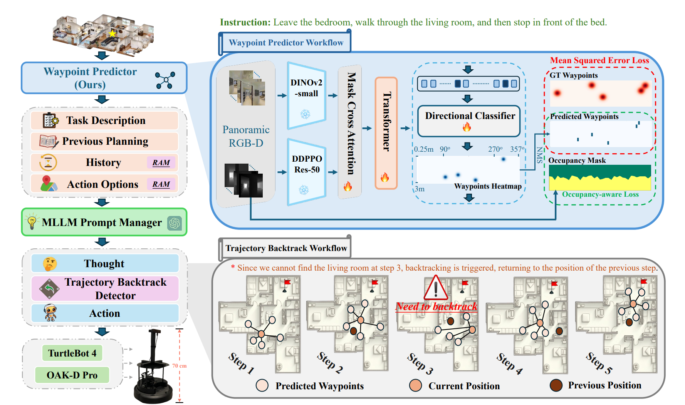

# 🚀 SmartWay: Enhanced Waypoint Prediction and Backtracking for Zero-Shot Vision-and-Language Navigation

<p align="center">
  <a href="https://arxiv.org/abs/2503.10069">
    
  </a>
  
</p>

<p align="center"><b>Official Implementation of IROS 2025 Paper</b></p>

<p align="center">
  <strong>SmartWay: Enhanced Waypoint Prediction and Backtracking for Zero-Shot Vision-and-Language Navigation</strong><br>
  <em>Xiangyu Shi*</em>, <em>Zerui Li*</em>, Wenqi Lyu, Jiatong Xia, Feras Dayoub, <br>
  <em>Yanyuan Qiao<sup>§</sup></em>, <em>Qi Wu<sup>†</sup></em>
</p>

<p align="center">
  <a href="https://arxiv.org/abs/2503.10069">📄 Paper</a>
  ·
  <a href="https://sxyxs.github.io/smartway/">🌐 Project Page</a>


</p>

---

## 🧠 Abstract

Vision-and-Language Navigation (VLN) in continuous environments requires agents to interpret natural language instructions while navigating unconstrained 3D spaces. Existing VLN-CE frameworks rely on a two-stage approach: a waypoint predictor to generate waypoints and a navigator to execute movements. However, current waypoint predictors struggle with spatial awareness, while navigators lack historical reasoning and backtracking capabilities, limiting adaptability.

We propose a **zero-shot VLN-CE framework** integrating an enhanced waypoint predictor with a Multi-modal Large Language Model (MLLM)-based navigator. Our predictor employs a stronger vision encoder, masked cross-attention fusion, and an occupancyaware loss for better waypoint quality. The navigator incorporates history-aware reasoning and adaptive path planning with backtracking, improving robustness. Experiments on R2R-CE and MP3D benchmarks show our method achieves state-of-theart (SOTA) performance in zero-shot settings, demonstrating competitive results compared to fully supervised methods.

🤖 We deploy our method on a TurtleBot 4 equipped with an OAK-D Pro camera, demonstrating its adaptability through real-world validation.

---

## 📦 Overview

<p align="center">
  
</p>

<p align="center"><i>Figure: SmartWay architecture, combining enhanced waypoint prediction and backtracking.</i></p>

---


## 📦 Environment Setup
```bash
# conda install
conda create -n smartway python==3.8.20
conda activate smartway

# pytorch
pip install torch==2.1.1 torchvision==0.16.1 torchaudio==2.1.1 --index-url https://download.pytorch.org/whl/cu121

# habitat-sim
wget https://anaconda.org/aihabitat/habitat-sim/0.1.7/download/linux-64/habitat-sim-0.1.7-py3.8_headless_linux_856d4b08c1a2632626bf0d205bf46471a99502b7.tar.bz2
conda install habitat-sim-0.1.7-py3.8_headless_linux_856d4b08c1a2632626bf0d205bf46471a99502b7.tar.bz2

# habitat-lab
git clone --branch v0.1.7 git@github.com:facebookresearch/habitat-lab.git
cd habitat-lab
python setup.py develop --all # install habitat and habitat_baselines
cd ..

# Adapt requirements.txt from Discrete-Continuous-VLN repo
python -m pip install -r requirements.txt
pip install webdataset
pip install openai tenacity timm fairscale
```
This project builds upon [Discrete-Continuous-VLN](https://github.com/YicongHong/Discrete-Continuous-VLN). Please refer to their repository to set up the required conda environment and dependencies. Smartway running under Python3.8.20.

> ℹ️ **Note**: All experiments are conducted using **Habitat v0.1.7**.


<!-- ## 📁 Dataset

Download the [dataset](https://drive.google.com/drive/folders/19Q9p5JH_vt5EOyQn65ClqjQM2qHgZD_y?usp=drive_link) and placed in:

```
/data/datasets/R2R_VLNCE_v1-2_preprocessed_BERTidx/
```
download [Matterport3D](https://niessner.github.io/Matterport/) and place the scene data in data/scene_datasets/mp3d/

you will get structure like scene_datasets/mp3d/{scene}/{scene}.glb
```
- data/
  - scene_datasets/
    - mp3d/
      - {scene_id}/
        - {scene_id}.glb
        - {scene_id}_semantic.ply
        - {scene_id}.house
        - {scene_id}.navmesh
```
For details on preparing the dataset, please refer to [OpenNav](https://github.com/YanyuanQiao/Open-Nav). -->

## 📁 Dataset Preparation

This project relies on **R2R VLN-CE** data and **Matterport3D** scene assets. Please follow the steps below to prepare the dataset correctly.

---

### 1️⃣ Download R2R VLN-CE Dataset

Download the preprocessed R2R VLN-CE dataset from the link below:

🔗 **datasets**
👉 [Google Drive Link](https://drive.google.com/drive/folders/1tYE02QH0x4QpdfFwvLKgOiBxosq0e-bg?usp=drive_link)

After downloading, place the dataset in:

```bash
/data/
```

---

### 2️⃣ Download Matterport3D Scene Data

Download the **Matterport3D** dataset from the official website:

🔗 [https://niessner.github.io/Matterport/](https://niessner.github.io/Matterport/)

You may need to apply for dataset access first.

Place the extracted scene data under:

```bash
data/scene_datasets/mp3d/
```

Each scene directory should follow the structure below.

---

### 3️⃣ Expected Directory Structure

After completing the above steps, your directory layout should look like this:

```text
data/
├── datasets/
│   └── R2R_VLNCE_v1-2_preprocessed/
│   └── R2R_VLNCE_v1-2_preprocessed_BERTidx/
├── pretrained_models/
|   └── ddppo-models
└── scene_datasets/
    └── mp3d/
        └── {scene_id}/
            ├── {scene_id}.glb
            ├── {scene_id}_semantic.ply
            ├── {scene_id}.house
            └── {scene_id}.navmesh
```

📌 **Note:**

* `{scene_id}` refers to a Matterport3D scene identifier (e.g., `17DRP5sb8fy`).
* For more details on dataset preparation and environment setup, please refer to:

    🔗 **Open-Nav Repository**
👉 [https://github.com/YanyuanQiao/Open-Nav](https://github.com/YanyuanQiao/Open-Nav)

    🔗 **DC-VLN Repository**
👉 [https://github.com/YicongHong/Discrete-Continuous-VLN](https://github.com/YicongHong/Discrete-Continuous-VLN)
## 📥 Pretrained Checkpoints

Download and place the following pretrained models:

* [Waypoint Predictor](https://drive.google.com/file/d/1TsKqtdR1oir4UFIGhq15ffETz6r8-P2Q/view)
  → Save to `waypoint_predictor/checkpoints/`

* [Depth Encoder (ResNet-50, gibson-2plus)](https://zenodo.org/record/6634113/files/gibson-2plus-resnet50.pth)
  → Save to `data/pretrained_models/ddppo-models/`

* [RAM+ (ram_plus_swin_large_14m.pth)](https://github.com/xinyu1205/recognize-anything)
  → Save to the root repo directory `/`

## 🧩 Third party 

- [Recognize Anything](https://github.com/xinyu1205/recognize-anything) — Please install this dependency before using the navigation module. 

  → Save to the root repo directory `/`

## 🚀 Run the repo

To run:

```bash
bash eval.sh
```

## 🙏 Acknowledgements

We thank [Discrete-Continuous-VLN](https://github.com/YicongHong/Discrete-Continuous-VLN) (adapt from this repo), [Dinov2](https://github.com/facebookresearch/dinov2), [OpenNav](https://github.com/YanyuanQiao/Open-Nav), [Recognize-Anything](https://github.com/xinyu1205/recognize-anything), [VLN-CE](https://github.com/jacobkrantz/VLN-CE), [MapGPT](https://github.com/chen-judge/MapGPT), and [Waypoint Predictor](https://github.com/wz0919/waypoint-predictor) for their inspiring work.
